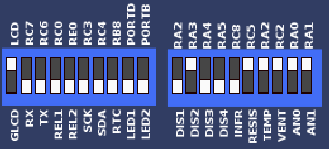

### Nota:

Utilizar versão do ```CCS 5.025``` ou superior.
É possível conferir a versão do seu CCS através do arquivo ```.ccspjt```

### Configuração da placa PIC16F877A

Configuração necessária para que a comunicação do potenciômetro + resistor seja utilizada.




